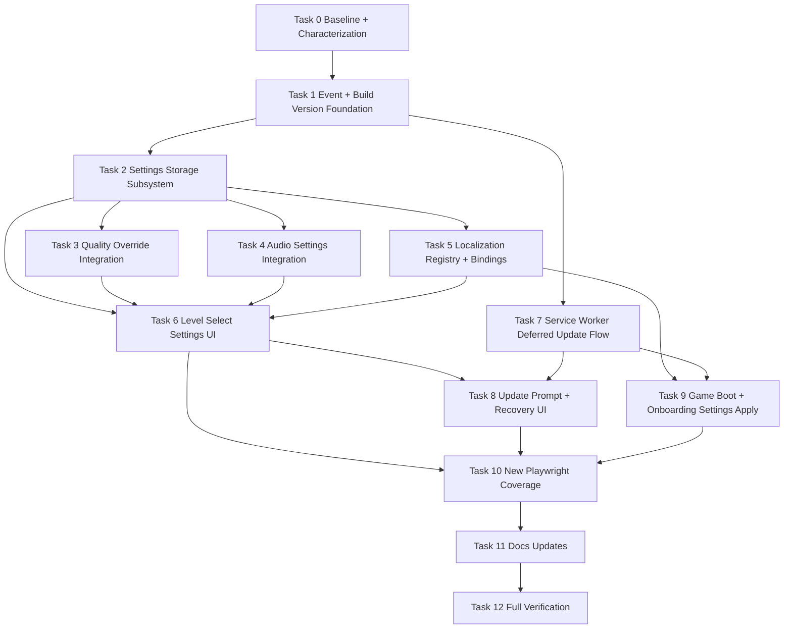

# Settings and Cache Implementation Plan
**Date:** 2026-04-10
**Source Design:** `.github/superpower/brainstorm/2026-04-10-settings-and-cache-design.md`
**Status:** Approved for execution

## Goal
Add a production-safe settings feature for display, UI/onboarding language, and sound, while hardening the deployment cache/update flow so stale builds do not interrupt active gameplay or serve mismatched runtime assets.

## Architecture
Keep the browser-native script-tag runtime, add a dedicated versioned settings subsystem on `window.UserSettings`, propagate changes through DOM events, and shift service-worker updates from immediate reload to deferred between-session prompts.

## Tech Stack
- Vanilla HTML/CSS/JS
- localStorage with safe fallbacks
- Service Worker Cache APIs
- Playwright
- ESLint
- TypeScript typecheck

## Estimated Complexity
12 tasks total: 2 XS, 5 S, 5 M

## Critical Path
Task 0 → Task 1 → Task 2 → Task 4 → Task 7 → Task 8 → Task 10 → Task 12

## Risk Assessment
- Highest risk task: Task 7, because the current service-worker registration immediately reloads on update and the game uses long-lived sessions.
- Mitigation: write update-flow tests first, keep the worker URL stable, version only app-owned caches, and defer refresh until level select or post-run.

## Assumptions
- Sound v1 ships with a reliable master mute surfaced in settings; the schema remains extensible for future music/effects splits.
- Fullscreen preference is not surfaced in the first UI unless capability detection proves stable during implementation.

## Dependency DAG

## Milestones
1. Foundation: Tasks 0-2. Deliverable: versioned settings store and event surface exist with tests.
2. Feature integration: Tasks 3-6. Deliverable: display, sound, and locale settings work from level select.
3. Deployment safety: Tasks 7-9. Deliverable: update detection and refresh behavior are deferred safely between sessions.
4. Release readiness: Tasks 10-12. Deliverable: tests, docs, and verification are complete.

## Rollback Points
- After Task 2: settings core exists but no user-facing UI yet.
- After Task 6: settings feature can be disabled by removing one level-select entrypoint.
- After Task 9: cache/update path can be rolled back independently of settings persistence.
- After Task 12: release candidate checkpoint.

## Task 0: Baseline + Characterization [S]
- Files: existing only; no code changes.
- Command: `npm run verify`
- Expected output: exits 0; no new line-limit, lint, or doc failures.
- Command: `npm run typecheck`
- Expected output: exits 0.
- Command: `npx playwright test tests/level-select-interactions.spec.js tests/level-select-scoreboard.spec.js tests/startup-preload.spec.js --reporter=line`
- Expected output: existing specs pass; this becomes the behavior baseline before touching level select, persistence, and service worker logic.

## Task 1: Event + Build Version Foundation [M]
- Failing test first: add assertions to a new `tests/service-worker-update.spec.js` that the runtime exposes one app build version, publishes an update-available signal, and does not auto-reload the page when an update is detected.
- Command: `npx playwright test tests/service-worker-update.spec.js --reporter=line`
- Expected output: FAIL, because no shared runtime version surface or deferred update signal exists yet.
- Implement minimal code in:
  - `src/scripts/constants.events.js`
  - new `src/scripts/build-version.js`
  - `src/pages/level-select.html`
  - `src/pages/game.html`
  - `src/scripts/service-worker-register.js`
- Implementation target: add stable events for `userSettingsLoaded`, `userSettingsChanged`, and `appUpdateAvailable`; expose `window.MathMasterBuildVersion`; load the build-version script before service-worker registration on both pages.
- Pass command: `npx playwright test tests/service-worker-update.spec.js --reporter=line`
- Expected output: PASS, with runtime version visible and update state observable without forced reload.

## Task 2: Settings Storage Subsystem [M]
- Failing test first: create `tests/settings-storage.spec.js` covering invalid payload reset, legacy payload normalization, in-memory fallback when localStorage throws, and event emission on updates.
- Command: `npx playwright test tests/settings-storage.spec.js --reporter=line`
- Expected output: FAIL, because `window.UserSettings` does not exist.
- Implement minimal code in:
  - new `src/scripts/user-settings.helpers.js`
  - new `src/scripts/user-settings.js`
  - `src/pages/level-select.html`
  - `src/pages/game.html`
- Implementation target: add `mathmaster_user_settings_v1`, a versioned default schema, safe read/write helpers, migration/normalization, `window.UserSettings`, and event dispatch with changed keys.
- Pass command: `npx playwright test tests/settings-storage.spec.js --reporter=line`
- Expected output: PASS, with deterministic defaults and safe fallback behavior.

## Task 3: Display Quality Override Integration [S]
- Failing test first: add a display-focused case to `tests/level-select-settings.spec.js` asserting that selecting `low`, `medium`, or `high` persists and drives the quality tier on first load instead of auto-detect only.
- Command: `npx playwright test tests/level-select-settings.spec.js --grep "quality override" --reporter=line`
- Expected output: FAIL, because the quality manager ignores user settings.
- Implement minimal code in:
  - `src/scripts/quality-tier-manager.core.js`
  - `src/scripts/quality-tier-manager.methods.js`
  - `src/scripts/user-settings.js`
- Implementation target: support a user override distinct from detected tier, preserve auto mode, and emit `qualityTierChanged` with both detected and applied tier.
- Pass command: `npx playwright test tests/level-select-settings.spec.js --grep "quality override" --reporter=line`
- Expected output: PASS.

## Task 4: Audio Settings Integration [S]
- Failing test first: add audio cases to `tests/level-select-settings.spec.js` asserting that master mute persists through settings, migrates from `mathmaster_audio_pref_v1` if present, and updates the existing audio control state.
- Command: `npx playwright test tests/level-select-settings.spec.js --grep "audio settings" --reporter=line`
- Expected output: FAIL, because the audio subsystem still owns its own isolated storage key and settings UI does not exist.
- Implement minimal code in:
  - `src/scripts/interaction-audio.cyberpunk.state.js`
  - `src/scripts/user-settings.helpers.js`
  - `src/scripts/user-settings.js`
- Implementation target: make settings the source of truth for mute state, migrate the old mute key once, and preserve the existing audio state-changed event semantics.
- Pass command: `npx playwright test tests/level-select-settings.spec.js --grep "audio settings" --reporter=line`
- Expected output: PASS.

## Task 5: Localization Registry + Bindings [M]
- Failing test first: create `tests/game-settings-localization.spec.js` covering locale changes for level-select copy and onboarding copy in game boot, with fallback to default English when a translation key is missing.
- Command: `npx playwright test tests/game-settings-localization.spec.js --reporter=line`
- Expected output: FAIL, because no locale registry or copy rebinding exists.
- Implement minimal code in:
  - new `src/scripts/user-settings.locale.js`
  - `src/pages/level-select.html`
  - `src/pages/game.html`
  - `src/scripts/game-onboarding.controller.js`
  - `src/scripts/user-settings.js`
- Implementation target: introduce a small locale dictionary for UI/onboarding strings, bind text through data attributes or explicit update hooks, and apply locale on initial load before visible onboarding copy is shown.
- Pass command: `npx playwright test tests/game-settings-localization.spec.js --reporter=line`
- Expected output: PASS.

## Task 6: Level Select Settings UI [M]
- Failing test first: extend `tests/level-select-interactions.spec.js` and `tests/level-select-settings.spec.js` to cover opening/closing settings, keyboard access, persistence across reload, and reset-to-default behavior.
- Command: `npx playwright test tests/level-select-interactions.spec.js tests/level-select-settings.spec.js --reporter=line`
- Expected output: FAIL, because the settings entrypoint and controls do not exist.
- Implement minimal code in:
  - `src/pages/level-select.html`
  - new `src/scripts/level-select-page.settings.js`
  - `src/scripts/level-select-page.js`
  - `src/scripts/level-select-page.interactions.js`
  - `src/styles/css/level-select.css`
- Implementation target: add a settings button on level select, an accessible dialog or panel, controls for quality mode, reduced motion, locale, and master mute, plus reset-to-default and recovery affordances.
- Pass command: `npx playwright test tests/level-select-interactions.spec.js tests/level-select-settings.spec.js --reporter=line`
- Expected output: PASS.

## Task 7: Service Worker Deferred Update Flow [M]
- Failing test first: extend `tests/service-worker-update.spec.js` and `tests/startup-preload.spec.js` to assert that update detection sets an available-update state, does not immediately reload an active page, and exposes a manual refresh path.
- Command: `npx playwright test tests/service-worker-update.spec.js tests/startup-preload.spec.js --reporter=line`
- Expected output: FAIL, because `service-worker-register.js` currently posts `SKIP_WAITING` and reloads on controller change.
- Implement minimal code in:
  - `service-worker.js`
  - `src/scripts/service-worker-register.js`
  - `src/scripts/build-version.js`
- Implementation target: keep `/service-worker.js` stable, namespace cache names by build version, clear only Math Master caches, switch navigation requests to network-first, stop auto-reloading on update detection, and publish `appUpdateAvailable` instead.
- Pass command: `npx playwright test tests/service-worker-update.spec.js tests/startup-preload.spec.js --reporter=line`
- Expected output: PASS.

## Task 8: Update Prompt + Recovery UI [S]
- Failing test first: add level-select coverage that a waiting update surfaces a refresh prompt, the prompt stays off during active gameplay, and the cache-clear recovery action remains available.
- Command: `npx playwright test tests/level-select-settings.spec.js tests/service-worker-update.spec.js --grep "update prompt|cache recovery" --reporter=line`
- Expected output: FAIL, because no UI consumes `appUpdateAvailable`.
- Implement minimal code in:
  - new `src/scripts/app-update-ui.js`
  - `src/pages/level-select.html`
  - `src/scripts/level-select-page.settings.js`
  - `src/styles/css/service-worker-register.css`
- Implementation target: show an update-available banner or row inside settings/level select, expose `Refresh now` and `Clear cache` actions, and keep the prompt suppressed during a run.
- Pass command: `npx playwright test tests/level-select-settings.spec.js tests/service-worker-update.spec.js --grep "update prompt|cache recovery" --reporter=line`
- Expected output: PASS.

## Task 9: Game Boot + Onboarding Settings Apply [S]
- Failing test first: add onboarding/runtime cases proving that locale and mute state are already applied when the game boots and before the onboarding dialog becomes interactive.
- Command: `npx playwright test tests/game-settings-localization.spec.js tests/startup-preload.spec.js --grep "boot applies settings|onboarding locale" --reporter=line`
- Expected output: FAIL, because settings are not yet loaded early enough in game boot.
- Implement minimal code in:
  - `src/pages/game.html`
  - `src/scripts/game-onboarding.bootstrap.js`
  - `src/scripts/game-onboarding.controller.js`
  - `src/scripts/interaction-audio.cyberpunk.bootstrap.js`
- Implementation target: load settings early in the game boot sequence so onboarding strings and audio state respect the chosen preferences immediately.
- Pass command: `npx playwright test tests/game-settings-localization.spec.js tests/startup-preload.spec.js --grep "boot applies settings|onboarding locale" --reporter=line`
- Expected output: PASS.

## Task 10: Consolidated Playwright Coverage [M]
- Test work only; no new production behavior.
- Add or stabilize:
  - `tests/settings-storage.spec.js`
  - `tests/level-select-settings.spec.js`
  - `tests/game-settings-localization.spec.js`
  - `tests/service-worker-update.spec.js`
  - updates in `tests/level-select-interactions.spec.js`
  - updates in `tests/startup-preload.spec.js`
- Command: `npx playwright test tests/settings-storage.spec.js tests/level-select-settings.spec.js tests/game-settings-localization.spec.js tests/service-worker-update.spec.js tests/level-select-interactions.spec.js tests/startup-preload.spec.js --reporter=line`
- Expected output: all targeted new and updated tests pass together, proving the feature works end to end.

## Task 11: Durable Docs Updates [S]
- Failing check first: run repository verification before docs changes to ensure the code changes are already stable.
- Command: `npm run verify`
- Expected output: exits 0; if not, fix code/test issues first.
- Implement documentation updates in:
  - `README.md`
  - `Docs/SystemDocs/ARCHITECTURE.md`
  - `Docs/SystemDocs/DEVELOPMENT_GUIDE.md`
- Documentation target: add the settings subsystem, note the level-select settings entrypoint, explain deferred update prompts and Math Master-specific cache versioning, and describe the safe local-storage model.
- Pass command: `npm run verify`
- Expected output: exits 0 with docs in sync.

## Task 12: Full Verification + Release Checkpoint [S]
- Command: `npm run typecheck`
- Expected output: exits 0.
- Command: `npm run verify`
- Expected output: exits 0.
- Command: `npx playwright test tests/settings-storage.spec.js tests/level-select-settings.spec.js tests/game-settings-localization.spec.js tests/service-worker-update.spec.js tests/level-select-interactions.spec.js tests/level-select-scoreboard.spec.js tests/startup-preload.spec.js --reporter=line`
- Expected output: targeted regression lane is green.
- Optional final confidence command if runtime surfaces changed broadly: `npm run test:competition:smoke`
- Expected output: smoke lane remains green.

## Parallel Work
- Parallel group A after Task 2: Tasks 3, 4, and 5 can proceed independently.
- Parallel group B after Tasks 6 and 7: Tasks 8 and 9 can proceed independently.
- Task 11 cannot start until Task 10 is stable.

## Why This Order
- Service-worker behavior is the highest-risk deployment concern, so the plan puts update signaling and deferred refresh under test before final UI wiring.
- Settings storage is the shared dependency for display, audio, and language, so it lands before any consumer integration.
- Level-select UI waits until the underlying behaviors are testable, which reduces rework and keeps the dialog implementation thin.
- Documentation is last so it reflects the final runtime shape rather than an intermediate draft.