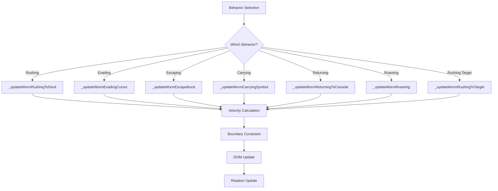

# Worm Movement System Test Suite

## Overview

This document describes the comprehensive test suite architecture for the worm movement system modules:

- `src/scripts/worm-movement-behaviors.js` - Behavior handlers (rushing, evasion, escape, symbol handling)
- `src/scripts/worm-movement-navigation.js` - Navigation logic (roaming, targeting, pathfinding)
- `src/scripts/worm-movement.js` - Core movement calculations (velocity, boundaries, crawl effects)
- `src/scripts/worm-evasion.js` - Cursor and obstacle avoidance behaviors
- `src/scripts/worm-movement-core.js` - Bridge layer to movement module

## Test Architecture

### Testing Pyramid

```
                    ┌─────────────────┐
                    │   E2E Tests     │  10% - Critical user journeys
                    │  (Playwright)   │
                    └────────┬────────┘
                             │
           ┌─────────────────┼─────────────────┐
           │                 │                 │
    ┌──────┴──────┐   ┌──────┴──────┐   ┌──────┴──────┐
    │ Integration │   │ Integration  │   │ Integration  │
    │   Tests     │   │   Tests      │   │   Tests      │
    │  (Behaviors)│   │ (Navigation) │   │  (System)    │
    └──────┬──────┘   └──────┬──────┘   └──────┬──────┘
           │                 │                 │
           └─────────────────┼─────────────────┘
                             │
           ┌─────────────────┼─────────────────┐
           │                 │                 │
    ┌──────┴──────┐   ┌──────┴──────┐   ┌──────┴──────┐
    │  Unit Tests  │   │  Unit Tests  │   │  Unit Tests  │
    │ (Movement)   │   │ (Evasion)    │   │ (Behaviors)  │
    └──────────────┘   └──────────────┘   └──────────────┘
```

### Test File Structure

```
tests/
├── unit/
│   ├── worm-movement.spec.js      # WormMovement class tests
│   ├── worm-evasion.spec.js       # WormEvasion class tests
│   └── worm-movement-core.spec.js # Core bridge tests
├── integration/
│   ├── worm-movement-behaviors.spec.js    # Behavior handler tests
│   ├── worm-movement-navigation.spec.js   # Navigation logic tests
│   └── worm-movement-system.spec.js       # System-level integration
├── performance/
│   └── worm-movement-bench.spec.js # Performance benchmarks
├── mocks/
│   ├── worm-mock.js               # Worm object factory
│   ├── movement-mock.js           # Movement module mock
│   ├── evasion-mock.js            # Evasion module mock
│   ├── navigation-mock.js         # Navigation mock
│   └── dom-mock.js                # DOM element mocking
├── utils/
│   ├── test-data-generators.js    # Test data generation
│   └── assertions.js              # Custom assertions
└── TESTING_ARCHITECTURE.md       # This documentation
```

## Unit Test Specifications

### WormMovement Class Tests (`worm-movement.spec.js`)

#### 1. Velocity Calculations

| Test Case                                   | Input                                  | Expected Output                               |
| ------------------------------------------- | -------------------------------------- | --------------------------------------------- |
| `calculateVelocityToTarget_normal`          | worm at (0,0), target (10,0), speed=1  | velocityX=1, velocityY=0, distance=10         |
| `calculateVelocityToTarget_diagonal`        | worm at (0,0), target (10,10), speed=1 | velocityX≈0.707, velocityY≈0.707              |
| `calculateVelocityToTarget_zeroDistance`    | worm at (5,5), target (5,5)            | velocityX=0, velocityY=0, direction preserved |
| `calculateVelocityToTarget_negativeCoords`  | worm at (100,100), target (50,50)      | Negative velocity components                  |
| `calculateVelocityToTarget_speedMultiplier` | Same as normal, multiplier=2           | Double velocity values                        |

#### 2. Boundary Constraints

| Test Case                                 | Input                      | Expected Output                           |
| ----------------------------------------- | -------------------------- | ----------------------------------------- |
| `constrainToBounds_leftEdge`              | x < margin                 | x = margin, direction mirrored            |
| `constrainToBounds_rightEdge`             | x > width - margin         | x = width - margin, direction mirrored    |
| `constrainToBounds_topEdge`               | y < margin                 | y = margin, direction Y inverted          |
| `constrainToBounds_bottomEdge`            | y > height - margin        | y = height - margin, direction Y inverted |
| `constrainToBounds_cornerHit`             | x and y both out of bounds | Both constraints applied                  |
| `constrainToBounds_insideBounds`          | Valid position             | No changes                                |
| `constrainToBounds_directionPreservation` | Edge hit                   | Direction reflected correctly             |

#### 3. Distance Calculations

| Test Case                       | Input                      | Expected Output |
| ------------------------------- | -------------------------- | --------------- |
| `calculateDistance_zeroPoints`  | (0,0) to (0,0)             | 0               |
| `calculateDistance_sameAxis`    | (0,0) to (10,0)            | 10              |
| `calculateDistance_diagonal`    | (0,0) to (3,4)             | 5               |
| `calculateDistance_largeCoords` | (1000,1000) to (2000,2000) | √(1000²+1000²)  |

#### 4. Target Detection

| Test Case                           | Input                     | Expected Output |
| ----------------------------------- | ------------------------- | --------------- |
| `hasReachedTarget_insideThreshold`  | distance=25, threshold=30 | true            |
| `hasReachedTarget_outsideThreshold` | distance=35, threshold=30 | false           |
| `hasReachedTarget_exactThreshold`   | distance=30, threshold=30 | true            |
| `isInsideRect_completelyInside`     | Point within rect bounds  | true            |
| `isInsideRect_outside`              | Point outside rect        | false           |
| `isInsideRect_onEdge`               | Point on boundary         | true            |

#### 5. Crawl Effects

| Test Case                   | Input                | Expected Output               |
| --------------------------- | -------------------- | ----------------------------- |
| `applyCrawlEffect_normal`   | Phase 0, direction 0 | Adjusted perpendicular offset |
| `applyCrawlEffect_piPhase`  | Phase π, direction 0 | Negative perpendicular offset |
| `applyCrawlEffect_wrapping` | Phase > 2π           | Wrapped to 0-2π range         |

### WormEvasion Class Tests (`worm-evasion.spec.js`)

#### 1. Cursor Threat Detection

| Test Case                       | Input                      | Expected Output |
| ------------------------------- | -------------------------- | --------------- |
| `isCursorThreat_insideRadius`   | distance=100, radius=140   | true            |
| `isCursorThreat_outsideRadius`  | distance=150, radius=140   | false           |
| `isCursorThreat_exactRadius`    | distance=140, radius=140   | true            |
| `isCursorThreat_inactiveCursor` | cursorState.isActive=false | false           |
| `isCursorThreat_nullCursor`     | cursorState=null           | false           |

#### 2. Escape Vector Calculation

| Test Case                                  | Input                          | Expected Output           |
| ------------------------------------------ | ------------------------------ | ------------------------- |
| `getCursorEscapeVector_normal`             | dx=100, dy=0, distance=100     | Correct normalized vector |
| `getCursorEscapeVector_insideEscapeRadius` | distance=150, escapeRadius=220 | Multiplier applied        |
| `getCursorEscapeVector_minDistance`        | distance=0                     | Prevents division by zero |
| `getCursorEscapeVector_negativeCoords`     | dx=-100, dy=-50                | Correct direction         |

#### 3. Obstacle Avoidance

| Test Case                                  | Input                  | Expected Output                          |
| ------------------------------------------ | ---------------------- | ---------------------------------------- |
| `applyObstacleAvoidance_noObstacles`       | empty array            | {x:0, y:0}                               |
| `applyObstacleAvoidance_singleObstacle`    | Obstacle in path       | Avoidance vector away from closest point |
| `applyObstacleAvoidance_multipleObstacles` | Multiple obstacles     | Combined avoidance vectors               |
| `applyObstacleAvoidance_outsidePadding`    | Worm far from obstacle | Minimal or zero adjustment               |
| `applyObstacleAvoidance_falloffRegion`     | Within 3x padding      | Proportional falloff                     |

### Behavior Handler Tests (`worm-movement-behaviors.spec.js`)

#### 1. Rushing to Devil

| Test Case                                 | Conditions         | Expected Behavior                     |
| ----------------------------------------- | ------------------ | ------------------------------------- |
| `_updateWormRushingToDevil_noDevilTarget` | devilX/Y undefined | Returns false, skipped                |
| `_updateWormRushingToDevil_atTarget`      | distance < 5       | Position updated, rotation set        |
| `_updateWormRushingToDevil_moving`        | distance > 5       | Velocity doubled, moved toward target |
| `_updateWormRushingToDevil_rotation`      | Any valid state    | Element rotated toward target         |

#### 2. Cursor Evasion

| Test Case                            | Conditions                   | Expected Behavior              |
| ------------------------------------ | ---------------------------- | ------------------------------ |
| `_updateWormEvadingCursor_notThreat` | Cursor outside threat radius | Returns false                  |
| `_updateWormEvadingCursor_hasStolen` | worm.hasStolen=true          | Returns false                  |
| `_updateWormEvadingCursor_evading`   | Cursor in threat radius      | Escape vector applied, bounded |
| `_updateWormEvadingCursor_rotation`  | Evasion active               | Direction and rotation updated |

#### 3. Escape Burst

| Test Case                        | Conditions                | Expected Behavior      |
| -------------------------------- | ------------------------- | ---------------------- |
| `_updateWormEscapeBurst_expired` | Date.now() > escapeUntil  | Returns false          |
| `_updateWormEscapeBurst_active`  | escapeUntil in future     | Burst velocity applied |
| `_updateWormEscapeBurst_bounds`  | Burst would exit viewport | Constrained to bounds  |

#### 4. Carrying Symbol

| Test Case                              | Conditions                          | Expected Behavior           |
| -------------------------------------- | ----------------------------------- | --------------------------- |
| `_updateWormCarryingSymbol_normal`     | hasStolen, not fromConsole          | Crawl movement applied      |
| `_updateWormCarryingSymbol_purpleExit` | Purple worm, shouldExitToConsole    | Moves toward console slot   |
| `_updateWormCarryingSymbol_arrival`    | Distance < DISTANCE_CONSOLE_ARRIVAL | Worm removed                |
| `_updateWormCarryingSymbol_pullIn`     | Distance < 50                       | Pull-in animation triggered |

#### 5. Returning to Console

| Test Case                               | Conditions                           | Expected Behavior    |
| --------------------------------------- | ------------------------------------ | -------------------- |
| `_updateWormReturningToConsole_valid`   | hasStolen, fromConsole, slot element | Moves toward console |
| `_updateWormReturningToConsole_arrival` | Distance < threshold                 | Worm removed         |
| `_updateWormReturningToConsole_pullIn`  | Distance < 50                        | Animation triggered  |

### Navigation Logic Tests (`worm-movement-navigation.spec.js`)

#### 1. Roaming Behavior

| Test Case                      | Conditions                  | Expected Behavior                          |
| ------------------------------ | --------------------------- | ------------------------------------------ |
| `_updateWormRoaming_hasStolen` | worm.hasStolen=true         | Returns false, skipped                     |
| `_updateWormRoaming_rushing`   | worm.isRushingToTarget=true | Returns false, skipped                     |
| `_updateWormRoaming_normal`    | Standard roaming            | Crawl movement, obstacle avoidance applied |
| `_updateWormRoaming_bounds`    | Near viewport edge          | Constrained to bounds                      |

#### 2. Rushing to Target

| Test Case                                    | Conditions                       | Expected Behavior                      |
| -------------------------------------------- | -------------------------------- | -------------------------------------- |
| `_updateWormRushingToTarget_noSymbols`       | Empty symbol list                | Falls back to roaming                  |
| `_updateWormRushingToTarget_resolved`        | Target element found             | Path calculated if pathfinding enabled |
| `_updateWormRushingToTarget_noPathfinding`   | usePathfinding=false             | Direct velocity to target              |
| `_updateWormRushingToTarget_withPathfinding` | Path available                   | Follows waypoints                      |
| `_updateWormRushingToTarget_arrival`         | Distance < DISTANCE_STEAL_SYMBOL | Symbol stolen                          |
| `_updateWormRushingToTarget_nearMiss`        | Distance < 80, >=30              | Warning triggered                      |
| `_updateWormRushingToTarget_aggression`      | Various aggression levels        | Speed multiplier applied               |

#### 3. Near-Miss System

| Test Case                               | Conditions             | Expected Behavior                          |
| --------------------------------------- | ---------------------- | ------------------------------------------ |
| `_triggerNearMissWarning_alreadyActive` | \_nearMissActive=true  | Ignored                                    |
| `_triggerNearMissWarning_firstTrigger`  | First time             | Warning state activated, CSS classes added |
| `_clearNearMissWarning_noActive`        | \_nearMissActive=false | No-op                                      |
| `_clearNearMissWarning_active`          | Active warning         | State cleared, CSS removed                 |

## Integration Test Specifications

### Behavior-to-Navigation Flow



### Test Scenarios

| Test ID | Scenario                               | Verifications                         |
| ------- | -------------------------------------- | ------------------------------------- |
| INT-001 | Behavior transition: Roaming → Rushing | Position continuity, no velocity jump |
| INT-002 | Behavior transition: Evading → Roaming | Smooth return to normal movement      |
| INT-003 | Multiple behaviors active              | Priority handling (evasion > rushing) |
| INT-004 | Pathfinding failure fallback           | Direct movement on path error         |
| INT-005 | Obstacle during navigation             | Avoidance applied, path adjusted      |

## Edge Cases and Boundary Conditions

### Position Boundary Tests

| Test Case    | Input Position              | Expected Result            |
| ------------ | --------------------------- | -------------------------- |
| Boundary-001 | x = margin - 0.001          | Clamped to margin          |
| Boundary-002 | x = margin                  | Valid, no clamp            |
| Boundary-003 | x = width - margin          | Valid, no clamp            |
| Boundary-004 | x = width - margin + 0.001  | Clamped to width - margin  |
| Boundary-005 | y = margin - 0.001          | Clamped to margin          |
| Boundary-006 | y = height - margin + 0.001 | Clamped to height - margin |

### Invalid Input Tests

| Test Case   | Input               | Expected Result        |
| ----------- | ------------------- | ---------------------- |
| Invalid-001 | null worm           | No error thrown        |
| Invalid-002 | undefined target    | Graceful handling      |
| Invalid-003 | NaN coordinates     | Fallback values        |
| Invalid-004 | Infinite values     | Clamped to safe range  |
| Invalid-005 | Negative dimensions | Default bounds applied |

### Rapid State Changes

| Test Case | Sequence                        | Expected Result        |
| --------- | ------------------------------- | ---------------------- |
| Rapid-001 | Evade → Roam → Evade in 1 frame | Last behavior wins     |
| Rapid-002 | Multiple target changes         | Current target used    |
| Rapid-003 | Boundary bounce rapid           | No position corruption |

## Performance Test Specifications

### Benchmark Criteria

| Test                 | Target Metric | Max Acceptable  |
| -------------------- | ------------- | --------------- |
| Velocity calculation | < 0.01ms      | 0.1ms           |
| Boundary constraint  | < 0.01ms      | 0.1ms           |
| Distance calculation | < 0.005ms     | 0.05ms          |
| Behavior update      | < 1ms         | 5ms             |
| Full frame update    | < 16ms        | 33ms (2 frames) |

### Load Test Scenarios

| Scenario                      | Duration | Updates/sec | Verification           |
| ----------------------------- | -------- | ----------- | ---------------------- |
| High-frequency target changes | 10s      | 60          | No frame drops         |
| Complex obstacle avoidance    | 10s      | 60          | All obstacles avoided  |
| Sustained high-speed movement | 30s      | 60          | No boundary violations |
| Mass worm simulation          | 10s      | 60          | All worms update       |

## Test Utilities

### Worm Mock Factory (`mocks/worm-mock.js`)

```javascript
function createWormMock(overrides = {}) {
  return {
    id: "worm-1",
    x: 100,
    y: 100,
    direction: 0,
    baseSpeed: 2,
    currentSpeed: 2,
    velocityX: 0,
    velocityY: 0,
    hasStolen: false,
    isPurple: false,
    fromConsole: false,
    isRushingToDevil: false,
    isRushingToTarget: false,
    devilX: undefined,
    devilY: undefined,
    escapeUntil: undefined,
    escapeVector: null,
    targetElement: null,
    path: null,
    pathIndex: 0,
    crawlPhase: 0,
    element: createElementMock(),
    ...overrides,
  };
}
```

### Movement Mock (`mocks/movement-mock.js`)

```javascript
function createMovementMock(overrides = {}) {
  return {
    calculateVelocityToTarget: jest.fn(),
    constrainToBounds: jest.fn(),
    hasReachedTarget: jest.fn(),
    calculateDistance: jest.fn(),
    ...overrides,
  };
}
```

### DOM Element Mock (`mocks/dom-mock.js`)

```javascript
function createElementMock() {
  const mock = {
    style: {
      left: "0px",
      top: "0px",
      transform: "",
    },
    classList: {
      add: jest.fn(),
      remove: jest.fn(),
      contains: jest.fn(),
    },
    getBoundingClientRect: jest.fn(() => ({
      left: 100,
      top: 100,
      width: 50,
      height: 50,
      right: 150,
      bottom: 150,
    })),
  };
  return mock;
}
```

## Coverage Targets

| Module       | Line Coverage | Branch Coverage | Function Coverage |
| ------------ | ------------- | --------------- | ----------------- |
| WormMovement | 95%           | 90%             | 100%              |
| WormEvasion  | 95%           | 90%             | 100%              |
| Behaviors    | 85%           | 80%             | 100%              |
| Navigation   | 85%           | 80%             | 100%              |
| Overall      | 90%           | 85%             | 100%              |

## Running Tests

### Local Development

```bash
# Run all tests
npm test

# Run with UI
npm run test:ui

# Run specific test file
npx playwright test tests/unit/worm-movement.spec.js

# Run with coverage
npx playwright test --coverage
```

### CI Pipeline

```bash
# Full test suite
npm test

# Quick verification
npm run verify:quick

# Type checking
npm run typecheck
```

## Known Limitations

1. **DOM-dependent tests**: Some behavior tests require DOM environment (Playwright)
2. **Pathfinding integration**: Full pathfinding tests require complete game context
3. **Animation timing**: Crawl effect visual tests are subjective
4. **Cross-browser**: Initial tests focus on Chromium

## Extending Tests

### Adding New Behavior Tests

1. Create test case following pattern in `worm-movement-behaviors.spec.js`
2. Use `createWormMock()` factory with specific overrides
3. Mock dependencies using `createMovementMock()`, `createEvasionMock()`
4. Verify state changes and return values

### Adding New Performance Tests

1. Add benchmark to `worm-movement-bench.spec.js`
2. Use `describe.bench()` pattern
3. Run under realistic load conditions
4. Record metrics for trend analysis
