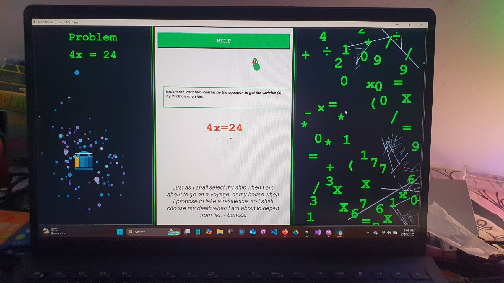

# 🎮 Math Master Algebra

> An educational algebra game with a Matrix-themed interface where players solve equations by clicking falling symbols. Features progressive lock animations and adversarial worm mechanics.

[](https://opensource.org/licenses/MIT)
[](https://developer.mozilla.org/en-US/docs/Web/HTML)
[](https://developer.mozilla.org/en-US/docs/Web/CSS)
[](https://developer.mozilla.org/en-US/docs/Web/JavaScript)


---

## 📖 Table of Contents

- [Features](#-features)
- [Demo](#-demo)
- [Installation](#-installation)
- [How to Play](#-how-to-play)
- [Game Mechanics](#-game-mechanics)
- [Technical Architecture](#-technical-architecture)
- [Project Structure](#-project-structure)
- [Development](#-development)
- [Contributing](#-contributing)
- [License](#-license)

---

## ✨ Features

### 🎯 Core Gameplay

- **Three Difficulty Levels**: Beginner (Addition/Subtraction), Warrior (Multiplication), Master (Division)
- **Step-by-Step Solutions**: Visual revelation of algebraic problem-solving process
- **Symbol Rain**: Matrix-style falling symbols for interactive gameplay
- **Progressive Lock System**: Visual feedback that evolves as you progress (6 levels)
- **Worm Adversaries**: Enemy system that steals symbols - click to save them!

### 🎨 Visual Design

- **Matrix Theme**: Green cascading symbols with cyberpunk aesthetics
- **Smooth Animations**: CSS3-powered lock transformations and worm movements
- **Responsive Design**: Works on desktop, tablet, and mobile devices
- **Orbitron Font**: Sci-fi themed typography

### 🧠 Educational Value

- **150 Problems Total**: 50 problems per difficulty level
- **Multiple Operations**: Addition, subtraction, multiplication, division
- **Visual Learning**: See each step of equation solving
- **Instant Feedback**: Visual cues for correct/incorrect answers

---

## 🎬 Demo

### Welcome Screen


### Level Selection


### Gameplay



---

## 🚀 Installation

### Quick Start

1. **Clone the repository**

   ```bash
   git clone https://github.com/TeacherEvan/MathMasterHTML.git
   cd MathMasterHTML
   ```

2. **Open in browser**

   ```bash
   # Simply open index.html in your browser
   # No build process required!
   ```

### Alternative: GitHub Pages

Visit the live version at: `https://teachereven.github.io/MathMasterHTML/`

---

## 🎮 How to Play

### Step-by-Step Guide

1. **Start the Game**
   - Open `index.html` in your browser
   - Click through the Matrix-themed welcome screen

2. **Select Your Level**
   - **Beginner**: Master addition and subtraction
   - **Warrior**: Tackle multiplication challenges
   - **Master**: Conquer division problems

3. **Solve the Problem**
   - Read the algebra problem displayed in **Panel A** (left)
   - Watch symbols fall in **Panel C** (right)
   - Click the correct symbols to reveal the solution in **Panel B** (middle)

4. **Watch Your Progress**
   - The lock animation in Panel A evolves every 2 completed solution lines
   - Complete all steps to solve the problem and move to the next one

5. **Battle the Worms**
   - Worms spawn after each completed line (max 4)
   - They steal hidden symbols from your solution
   - **Click worms** to destroy them and save the symbols!

6. **Use the Help Button**
   - Stuck? Click the **?** button in Panel B
   - It reveals one random symbol from the current line

---

## 🎲 Game Mechanics

### Symbol Revelation System

- Solutions are revealed **symbol-by-symbol**, not character-by-character
- Each solution line must be completed before moving to the next
- Case-insensitive matching (X and x are treated identically)

### Lock Animation Progression

- **Cumulative Progress**: Lock levels advance based on total completed lines across ALL problems
- **Formula**: Every 2 completed lines = 1 lock level advancement
- **Level Caps**:
  - Beginner/Warrior: Maximum Level 3
  - Master: All 6 levels unlocked

### Worm System

- **Spawning**: 1 worm per completed solution line (max 4 active)
- **Behavior**: Random ground-based movement
- **Theft Cycle**: Attempts to steal symbols every 10 seconds
- **Defeat**: Click worm to destroy and return stolen symbol

### Event-Driven Architecture

The game uses custom DOM events for communication:

- `symbolClicked` - Player clicked a falling symbol
- `first-line-solved` - First correct answer triggers lock animation
- `problemLineCompleted` - Line finished → spawn worm + progress lock
- `wormSymbolSaved` - Player saved symbol by clicking worm

---

## 🏗️ Technical Architecture

### Technology Stack

- **HTML5** - Semantic structure
- **CSS3** - Animations, gradients, responsive design
- **Vanilla JavaScript** - No frameworks or dependencies
- **Google Fonts** - Orbitron (monospace sci-fi)

### Three-Panel Layout

```
┌─────────────┬──────────────────┬─────────────┐
│   Panel A   │     Panel B      │   Panel C   │
├─────────────┼──────────────────┼─────────────┤
│  Problem    │  Solution Area   │  Symbol     │
│  Display    │  + Worm Zone     │  Rain       │
│     +       │  + Help Button   │  (Matrix)   │
│  Lock       │                  │             │
│  Animation  │                  │             │
└─────────────┴──────────────────┴─────────────┘
```

### Core Components

| File | Purpose | Lines |
|------|---------|-------|
| `js/game.js` | Main game logic, problem parsing, symbol validation | 515 |
| `js/lock-manager.js` | Progressive lock animation system (LockManager class) | 634 |
| `js/worm.js` | Enemy mechanics system (WormSystem class) | 230 |
| `js/3rdDISPLAY.js` | Symbol rain rendering and click detection | ~200 |

### Problem Format

Problems are stored in Markdown files:

```markdown
## Pattern 1: a + b - X = c

1. `5 + 3 - X = 6`
   - 5 + 3 - X = 6
   - 8 - X = 6
   - X = 8 - 6
   - X = 2
```

**Parsing**: Regex `/(\d+)\.\s+`([^`]+)`\s*\n((?:\s*-[^\n]+\n?)+)/g` extracts problem and solution steps.

---

## 📁 Project Structure

```
MathMaster-Algebra/
├── index.html                 # Welcome screen
├── level-select.html          # Difficulty selection
├── game.html                  # Main game interface
├── Assets/
│   ├── Beginner_Lvl/
│   │   └── beginner_problems.md   # 50 problems
│   ├── Warrior_Lvl/
│   │   └── warrior_problems.md    # 50 problems
│   └── Master_Lvl/
│       └── master_problems.md     # 50 problems
├── js/
│   ├── game.js                # Core game logic
│   ├── lock-manager.js        # Lock animation system
│   ├── worm.js                # Worm mechanics
│   └── 3rdDISPLAY.js          # Symbol rain
├── css/
│   ├── game.css               # Three-panel layout
│   ├── lock-responsive.css    # Lock scaling
│   └── worm-styles.css        # Worm animations
├── lock-components/
│   ├── Line-1-transformer.html
│   ├── line-2-transformer.html
│   ├── line-3-transformer.html
│   ├── line-4-transformer.html
│   ├── Line-5-transformer.html
│   └── line-6-transformer.html
└── Docs/
    ├── BugFix_Jobcard_Critical.md
    ├── Worm_System_Improvements.md
    └── Lock animation audit.md
```

---

## 🛠️ Development

### Prerequisites

- Modern web browser (Chrome, Firefox, Edge, Safari)
- Text editor (VS Code recommended)
- No build tools or package managers required!

### Local Development

1. **Open the project**

   ```bash
   code .
   ```

2. **Start testing**
   - Open `index.html` in browser
   - Or use Live Server extension in VS Code

3. **Debug with Console**
   - Extensive emoji-prefixed logging:
     - 🎮 Game state
     - 🔒 Lock manager
     - 🐛 Worm system
     - 📚 Problem loading
     - 🎯 Symbol matching

### Testing Workflow

**Testing Path**: `index.html` → `level-select.html` → `game.html?level=beginner`

**Lock Animation Testing**:

```javascript
// In browser console:
lockManager.forceLockLevel(3);  // Jump to level 3
lockManager.getDebugInfo();      // Inspect state
```

**Worm Spawn Testing**:

```javascript
// Manually trigger:
document.dispatchEvent(new CustomEvent('problemLineCompleted'));
```

### Common Issues

| Issue | Solution |
|-------|----------|
| Lock not appearing | Check `first-line-solved` event dispatch |
| Lock stuck at level 1 | Verify `completedLinesCount++` |
| Symbols not revealing | Check X/x normalization |
| Worms not spawning | Check event listener in WormSystem |
| Multiple clicks needed | Symbol detection missing normalization |

---

## 🤝 Contributing

Contributions are welcome! Here's how you can help:

### Reporting Bugs

1. Check existing issues
2. Create detailed bug report with:
   - Browser and version
   - Steps to reproduce
   - Expected vs actual behavior
   - Console errors (if any)

### Suggesting Features

- Open an issue with `[FEATURE]` prefix
- Describe the feature and use case
- Include mockups if applicable

### Code Contributions

1. Fork the repository
2. Create a feature branch (`git checkout -b feature/AmazingFeature`)
3. Commit your changes (`git commit -m 'Add some AmazingFeature'`)
4. Push to the branch (`git push origin feature/AmazingFeature`)
5. Open a Pull Request

### Development Guidelines

- Follow existing code style (see `.github/copilot-instructions.md`)
- Use emoji-prefixed console logging
- Test on multiple browsers
- Update documentation if needed

---

## 📝 License

This project is licensed under the MIT License - see the [LICENSE](LICENSE) file for details.

---

## 👨‍🏫 Credits

**Created by**: Teacher Evan  
**Repository**: [MathMasterHTML](https://github.com/TeacherEvan/MathMasterHTML)  
**Purpose**: Educational tool for teaching algebra through interactive gameplay

### Special Thanks

- Google Fonts for Orbitron typeface
- The Matrix (1999) for visual inspiration
- Students who tested and provided feedback

---

## 🎯 Future Enhancements

Planned features (see issue tracker):

- [ ] Sound effects and background music
- [ ] Leaderboard system
- [ ] Achievement badges
- [ ] More worm types with special abilities
- [ ] Custom problem creation tool
- [ ] Multiplayer mode
- [ ] Mobile app version

---

## 📞 Contact

For questions, suggestions, or collaboration:

- **GitHub Issues**: [Create an issue](https://github.com/TeacherEvan/MathMasterHTML/issues)
- **Email**: Contact through GitHub profile

---

<div align="center">

**Made with ❤️ for math education**

[⬆ Back to Top](#-math-master-algebra)

</div>
