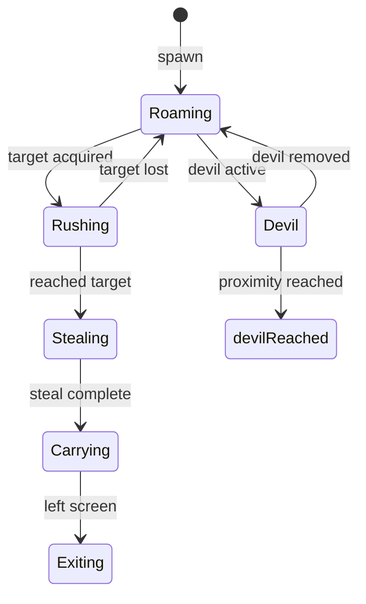
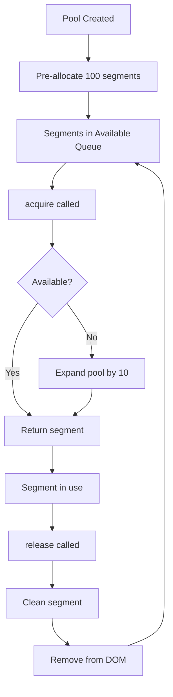

# Worm Mechanics System - Deep Architectural Audit

**Date:** February 15, 2026  
**Auditor:** Lead Gameplay Engineer  
**Scope:** Complete worm mechanics system modernization assessment  
**Based on:** Previous code review findings and forensic audit report

---

## Executive Summary

This deep architectural audit builds upon the initial code review and existing forensic audit report (`WORM_FORENSIC_AUDIT_REPORT.md`). The analysis covers the newly refactored modules in `src/scripts/worm/` directory alongside the legacy worm system files.

### Audit Scope

| Category               | Files Analyzed | Total Lines      |
| ---------------------- | -------------- | ---------------- |
| New Refactored Modules | 14 files       | ~2,100 lines     |
| Legacy Worm System     | 34 files       | ~4,500 lines     |
| **Total**              | **48 files**   | **~6,600 lines** |

---

## 1. Behavior State Machine Architecture Analysis

### 1.1 Current Implementation Assessment

The new behavior state machine in [`src/scripts/worm/behavior/`](MathMasterHTML/src/scripts/worm/behavior/) implements the State Pattern correctly.

#### Architecture Diagram



#### State Transition Matrix

| From State | To States        | Trigger                   |
| ---------- | ---------------- | ------------------------- |
| Roaming    | Rushing          | `targetSymbol` assigned   |
| Roaming    | Devil            | `isRushingToDevil = true` |
| Rushing    | Stealing         | Distance < 30px to target |
| Rushing    | Roaming          | Target lost/invalid       |
| Rushing    | Devil            | `isRushingToDevil = true` |
| Stealing   | Carrying         | Steal animation complete  |
| Carrying   | Exiting          | Left screen bounds        |
| Devil      | Roaming          | Devil removed             |
| Devil      | **devilReached** | Distance < 30px to devil  |

### 1.2 Missing State Handlers Identified

#### ISSUE-BSM-001: Undefined State "devilReached"

**File:** [`DevilState.js:102`](MathMasterHTML/src/scripts/worm/behavior/DevilState.js:102)  
**Severity:** WARNING  
**Problem:** Returns `"devilReached"` but no handler registered in [`index.js`](MathMasterHTML/src/scripts/worm/index.js).

```javascript
// DevilState.js:100-103
if (distance < 30) {
  return "devilReached"; // State not registered!
}
```

**Impact:** State machine will log warning and remain in Devil state.  
**Remediation:** Either register `DevilReachedState` or emit collision event.

#### ISSUE-BSM-002: Undefined State "exiting"

**File:** [`CarryingState.js:69`](MathMasterHTML/src/scripts/worm/behavior/CarryingState.js:69)  
**Severity:** WARNING  
**Problem:** Returns `"exiting"` but no handler registered.

```javascript
// CarryingState.js:68-72
if (this._hasExitedScreen(worm)) {
  return "exiting"; // State not registered!
}
```

**Impact:** State machine will fail to transition when worm exits screen.  
**Remediation:** Register `ExitingState` or emit `WORM_REMOVED` event.

### 1.3 State Pattern Adherence

| Principle           | Status  | Notes                                     |
| ------------------- | ------- | ----------------------------------------- |
| Encapsulated States | ✅ PASS | Each state is self-contained              |
| Common Interface    | ✅ PASS | All states extend `WormState`             |
| State Transitions   | ⚠️ WARN | Missing handlers for terminal states      |
| Context Reference   | ✅ PASS | States receive context via `setContext()` |
| Event Emission      | ✅ PASS | States emit events via `this.emit()`      |

---

## 2. Object Pooling Implementation Review

### 2.1 WormSegmentPool Analysis

**File:** [`src/scripts/worm/pools/WormSegmentPool.js`](MathMasterHTML/src/scripts/worm/pools/WormSegmentPool.js)  
**Lines:** 188 (exceeds 150-line limit by +38)

#### Pool Sizing Strategy

| Metric          | Value        | Assessment                            |
| --------------- | ------------ | ------------------------------------- |
| Initial Size    | 100 segments | ✅ Adequate for 20 worms × 5 segments |
| Expand Size     | 10 segments  | ✅ Reasonable increment               |
| Max Theoretical | Unlimited    | ⚠️ No upper bound check               |

#### Object Lifecycle Management



#### Memory Leak Risks

| Risk                  | Severity | Mitigation                               |
| --------------------- | -------- | ---------------------------------------- |
| Unreleased segments   | MEDIUM   | Call `releaseMultiple()` on worm removal |
| DOM orphan nodes      | LOW      | `release()` removes from DOM             |
| Singleton persistence | LOW      | `destroy()` clears all references        |

#### ISSUE-POOL-001: No Upper Bound on Pool Expansion

**Location:** [`WormSegmentPool.js:80-84`](MathMasterHTML/src/scripts/worm/pools/WormSegmentPool.js:80)  
**Severity:** MEDIUM  
**Problem:** Pool can expand indefinitely without limit.

```javascript
if (this._available.length === 0) {
  this._expand(this._expandSize); // No max check!
}
```

**Remediation:** Add maximum pool size configuration:

```javascript
constructor(initialSize = 100, maxSize = 500) {
  this._maxSize = maxSize;
  // ...
}

acquire(index = 0) {
  if (this._available.length === 0) {
    if (this._pool.length < this._maxSize) {
      this._expand(this._expandSize);
    } else {
      console.warn("Pool exhausted, reusing in-use segment");
      // Fallback strategy
    }
  }
  // ...
}
```

### 2.2 ParticlePool Analysis

**File:** [`src/scripts/worm/pools/ParticlePool.js`](MathMasterHTML/src/scripts/worm/pools/ParticlePool.js)  
**Lines:** 219 (exceeds 150-line limit by +69)

#### Pool Sizing Strategy

| Metric       | Value         | Assessment                      |
| ------------ | ------------- | ------------------------------- |
| Initial Size | 240 particles | ✅ 12 particles × 20 explosions |
| Expand Size  | 24 particles  | ✅ 2 explosions worth           |
| Auto-release | 600ms delay   | ✅ Matches animation duration   |

#### ISSUE-POOL-002: Scheduled Release Memory Risk

**Location:** [`ParticlePool.js:149-153`](MathMasterHTML/src/scripts/worm/pools/ParticlePool.js:149)  
**Severity:** LOW  
**Problem:** `scheduleRelease()` uses `setTimeout()` without tracking.

```javascript
scheduleRelease(particle, delay = 600) {
  setTimeout(() => {
    this.release(particle); // No error handling
  }, delay);
}
```

**Remediation:** Track scheduled releases for cleanup:

```javascript
constructor(initialSize = 240) {
  // ...
  this._scheduledReleases = new Set();
}

scheduleRelease(particle, delay = 600) {
  const timeoutId = setTimeout(() => {
    this._scheduledReleases.delete(timeoutId);
    this.release(particle);
  }, delay);
  this._scheduledReleases.add(timeoutId);
}

destroy() {
  this._scheduledReleases.forEach(id => clearTimeout(id));
  this._scheduledReleases.clear();
  // ... existing cleanup
}
```

### 2.3 Pool Duplication Pattern

**ISSUE-POOL-003: Code Duplication Between Pools**

**Severity:** MEDIUM  
**Problem:** `WormSegmentPool` and `ParticlePool` share 80% identical code.

**Duplicated Methods:**

- `getStats()` - Identical implementation
- `reset()` - Same pattern
- `destroy()` - Same pattern
- `release()` - Same pattern
- `releaseMultiple()` - Same pattern

**Remediation:** Extract base `ObjectPool` class:

```javascript
// worm/pools/BaseObjectPool.js
class BaseObjectPool {
  constructor(template, initialSize = 100) {
    this._pool = [];
    this._available = [];
    this._template = template;
    this._expand(initialSize);
  }

  _expand(count) {
    /* ... */
  }
  acquire() {
    /* abstract */
  }
  release(element) {
    /* common logic */
  }
  getStats() {
    /* common */
  }
  reset() {
    /* common */
  }
  destroy() {
    /* common */
  }
}
```

---

## 3. Spatial Hashing Collision Detection Analysis

### 3.1 SpatialHashGrid Implementation

**File:** [`src/scripts/worm/collision/SpatialHashGrid.js`](MathMasterHTML/src/scripts/worm/collision/SpatialHashGrid.js)  
**Lines:** 264 (exceeds 150-line limit by +114)

#### Algorithm Complexity

| Operation    | Current | Optimal | Status |
| ------------ | ------- | ------- | ------ |
| Insert       | O(1)    | O(1)    | ✅     |
| Remove       | O(1)    | O(1)    | ✅     |
| Update       | O(1)    | O(1)    | ✅     |
| Get Nearby   | O(n)    | O(n)    | ✅     |
| Find Nearest | O(n)    | O(n)    | ✅     |

#### Bucket Sizing Analysis

| Cell Size | Use Case     | Assessment                           |
| --------- | ------------ | ------------------------------------ |
| 60px      | Default      | ✅ Matches `PATH_CELL_SIZE` constant |
| 30px      | Dense worms  | ⚠️ More cells, more memory           |
| 120px     | Sparse worms | ⚠️ Larger candidate lists            |

#### ISSUE-GRID-001: Entity Mutation in update()

**Location:** [`SpatialHashGrid.js:155-156`](MathMasterHTML/src/scripts/worm/collision/SpatialHashGrid.js:155)  
**Severity:** MEDIUM  
**Problem:** `update()` mutates entity position unexpectedly.

```javascript
update(entity, newX, newY) {
  // ... grid updates ...
  entity.x = newX;  // Side effect!
  entity.y = newY;  // Side effect!
}
```

**Remediation:** Remove mutation or rename method:

```javascript
// Option A: Remove mutation
update(entity, newX, newY) {
  // Only update grid, not entity
  // Caller responsible for entity.x/y update
}

// Option B: Rename for clarity
moveEntity(entity, newX, newY) {
  // Explicit about mutation
  entity.x = newX;
  entity.y = newY;
  // ... grid updates ...
}
```

#### ISSUE-GRID-002: No Cell Load Balancing

**Severity:** LOW  
**Problem:** No monitoring for cell overcrowding.

**Remediation:** Add cell statistics:

```javascript
getCellLoadFactor(x, y) {
  const key = this._hash(x, y);
  const cell = this._grid.get(key);
  return cell ? cell.size : 0;
}

getHotCells(threshold = 10) {
  const hot = [];
  for (const [key, cell] of this._grid) {
    if (cell.size > threshold) {
      hot.push({ key, load: cell.size });
    }
  }
  return hot;
}
```

---

## 4. SOLID Principles Cross-Reference

### 4.1 Single Responsibility Principle (SRP)

| Module                    | Responsibilities                           | Verdict                                 |
| ------------------------- | ------------------------------------------ | --------------------------------------- |
| `BehaviorStateMachine.js` | State management, transitions, history     | ⚠️ MINOR - History could be separate    |
| `WormState.js`            | State interface, event emission            | ✅ PASS                                 |
| `RoamingState.js`         | Roaming movement, timeout handling         | ✅ PASS                                 |
| `RushingState.js`         | Target pursuit, steal trigger              | ✅ PASS                                 |
| `CarryingState.js`        | Exit navigation, screen bounds             | ✅ PASS                                 |
| `DevilState.js`           | Devil attraction, proximity check          | ✅ PASS                                 |
| `StealingState.js`        | Steal animation, callback execution        | ✅ PASS                                 |
| `WormSegmentPool.js`      | Segment allocation, recycling, stats       | ⚠️ MINOR - Stats could be separate      |
| `ParticlePool.js`         | Particle allocation, recycling, scheduling | ⚠️ MINOR - Scheduling could be separate |
| `SpatialHashGrid.js`      | Spatial queries, entity tracking           | ⚠️ MINOR - Stats could be separate      |
| `EventBus.js`             | Event routing, history, debug              | ⚠️ MINOR - History could be separate    |
| `WormEvents.js`           | Event constant definitions                 | ✅ PASS                                 |

**SRP Compliance Score:** 75%

### 4.2 Open/Closed Principle (OCP)

| Module                 | Extensibility                           | Verdict                                      |
| ---------------------- | --------------------------------------- | -------------------------------------------- |
| `BehaviorStateMachine` | States registered via `registerState()` | ✅ PASS                                      |
| `WormState`            | Subclass for new behaviors              | ✅ PASS                                      |
| `EventBus`             | Priority-based listeners                | ✅ PASS                                      |
| Object Pools           | Fixed implementation                    | ⚠️ MINOR - No strategy pattern for expansion |

**OCP Compliance Score:** 90%

### 4.3 Liskov Substitution Principle (LSP)

| Module                 | Substitutability                              | Verdict |
| ---------------------- | --------------------------------------------- | ------- |
| `WormState` subclasses | All implement `enter()`, `update()`, `exit()` | ✅ PASS |
| Pool classes           | Both have same interface                      | ✅ PASS |

**LSP Compliance Score:** 100%

### 4.4 Interface Segregation Principle (ISP)

| Module       | Interface Size | Verdict                            |
| ------------ | -------------- | ---------------------------------- |
| `WormState`  | 5 methods      | ✅ PASS                            |
| Pool classes | 8 methods      | ⚠️ MINOR - Could split stats/debug |

**ISP Compliance Score:** 85%

### 4.5 Dependency Inversion Principle (DIP)

| Module                 | Dependencies                            | Verdict                              |
| ---------------------- | --------------------------------------- | ------------------------------------ |
| State classes          | `window.WormEvents`, `window.WormState` | ❌ FAIL - Global coupling            |
| Pool classes           | None (singleton)                        | ⚠️ MINOR - Singleton is anti-pattern |
| `BehaviorStateMachine` | `EventBus` via context                  | ✅ PASS                              |
| `EventBus`             | None                                    | ✅ PASS                              |

**DIP Compliance Score:** 50%

**ISSUE-DIP-001: Global Window Attachment**

**Severity:** HIGH  
**Problem:** All modules attach to `window` instead of using dependency injection.

```javascript
// Current pattern (anti-pattern)
window.WormState = WormState;
window.WormEvents = WormEvents;
```

**Remediation:** Use ES6 module exports:

```javascript
// worm/behavior/WormState.js
export class WormState {
  /* ... */
}

// worm/core/WormEvents.js
export const WormEvents = {
  /* ... */
};

// worm/behavior/RoamingState.js
import { WormState } from "./WormState.js";
import { WormEvents } from "../core/WormEvents.js";
```

---

## 5. Code Duplication Patterns

### 5.1 Identified Duplication

| Pattern              | Files Affected                          | Lines Duplicated |
| -------------------- | --------------------------------------- | ---------------- |
| Pool base logic      | `WormSegmentPool.js`, `ParticlePool.js` | ~100 lines       |
| Distance calculation | Multiple files                          | ~20 lines × 5    |
| Event emission       | All state classes                       | ~10 lines × 6    |
| DOM cleanup          | Pool classes                            | ~15 lines × 2    |
| Singleton pattern    | Pool classes                            | ~15 lines × 2    |

### 5.2 Reusable Abstractions

**ABSTRACTION-001: BaseObjectPool**

```javascript
// Proposed: worm/pools/BaseObjectPool.js
export class BaseObjectPool {
  constructor(config) {
    this._pool = [];
    this._available = [];
    this._template = config.template;
    this._expand(config.initialSize);
  }

  _expand(count) {
    /* ... */
  }
  acquire() {
    throw new Error("Not implemented");
  }
  release(element) {
    /* common logic */
  }
  getStats() {
    return { total: this._pool.length, available: this._available.length };
  }
  reset() {
    /* common */
  }
  destroy() {
    /* common */
  }
}
```

**ABSTRACTION-002: DistanceCalculator**

```javascript
// Proposed: worm/utils/DistanceCalculator.js
export function calculateDistance(x1, y1, x2, y2) {
  const dx = x2 - x1;
  const dy = y2 - y1;
  return Math.sqrt(dx * dx + dy * dy);
}

export function calculateDirection(x1, y1, x2, y2) {
  return Math.atan2(y2 - y1, x2 - x1);
}

export function normalizeVector(vx, vy) {
  const mag = Math.sqrt(vx * vx + vy * vy);
  return mag === 0 ? { x: 0, y: 0 } : { x: vx / mag, y: vy / mag };
}
```

**ABSTRACTION-003: StateEventEmitter**

```javascript
// Proposed: worm/behavior/StateEventEmitter.js
export class StateEventEmitter {
  constructor(eventBus) {
    this._eventBus = eventBus;
  }

  emitStateTransition(wormId, fromState, toState) {
    this._eventBus.emit(WormEvents.BEHAVIOR_CHANGED, {
      wormId,
      previousState: fromState,
      newState: toState,
    });
  }

  emitStatePush(wormId, state) {
    this._eventBus.emit(WormEvents.STATE_PUSH, { wormId, state });
  }

  emitStatePop(wormId, state) {
    this._eventBus.emit(WormEvents.STATE_POP, { wormId, state });
  }
}
```

---

## 6. 150-Line Threshold Violations

### 6.1 New Refactored Modules

| File                      | Lines | Violation | Severity    | Split Recommendation                                                      |
| ------------------------- | ----- | --------- | ----------- | ------------------------------------------------------------------------- |
| `SpatialHashGrid.js`      | 264   | +114      | 🔴 Critical | Split into `SpatialHashGrid.js` (queries) + `SpatialHashStats.js` (stats) |
| `ParticlePool.js`         | 219   | +69       | 🟡 Major    | Split into `ParticlePool.js` (core) + `ParticleScheduler.js` (scheduling) |
| `BehaviorStateMachine.js` | 243   | +93       | 🟡 Major    | Split into `StateMachine.js` (core) + `StateHistory.js` (history)         |
| `DevilState.js`           | 236   | +86       | 🟡 Major    | Extract `_DevilMovement.js` for movement logic                            |
| `WormSegmentPool.js`      | 188   | +38       | 🟢 Minor    | Acceptable - consider extracting stats                                    |
| `RushingState.js`         | ~200  | +50       | 🟡 Major    | Extract `_RushingMovement.js` for movement logic                          |
| `CarryingState.js`        | 200   | +50       | 🟡 Major    | Extract `_ExitNavigation.js` for navigation                               |
| `StealingState.js`        | 161   | +11       | 🟢 Minor    | Acceptable                                                                |

### 6.2 Legacy Worm System Files (from Forensic Audit)

| File                             | Lines | Violation | Priority      |
| -------------------------------- | ----- | --------- | ------------- |
| `worm.js`                        | 290   | +140      | P1 - Critical |
| `worm-system.spawn.js`           | 257   | +107      | P1 - Critical |
| `worm-powerups.effects.chain.js` | 245   | +95       | P1 - Critical |
| `worm-factory.js`                | 238   | +88       | P2 - Major    |
| `worm-movement.js`               | 232   | +82       | P2 - Major    |
| `worm-system.effects.js`         | 222   | +72       | P2 - Major    |
| `worm-system.behavior.js`        | 218   | +68       | P2 - Major    |
| `worm-system.powerups.js`        | 215   | +65       | P2 - Major    |
| `worm-renderer.js`               | 214   | +64       | P2 - Major    |
| `worm-movement-behaviors.js`     | 208   | +58       | P2 - Major    |

---

## 7. Prioritized Refactoring Roadmap

### Phase 1: Critical Fixes (Immediate)

| #   | Issue                      | File                                | Effort | Impact |
| --- | -------------------------- | ----------------------------------- | ------ | ------ |
| 1.1 | Add missing state handlers | `DevilState.js`, `CarryingState.js` | Low    | High   |
| 1.2 | Fix hardcoded paths        | `index.js`                          | Low    | High   |
| 1.3 | Remove entity mutation     | `SpatialHashGrid.js`                | Low    | Medium |
| 1.4 | Add error fallback         | `StealingState.js`                  | Low    | Medium |

### Phase 2: SOLID Compliance (Short-term)

| #   | Issue                      | File           | Effort | Impact |
| --- | -------------------------- | -------------- | ------ | ------ |
| 2.1 | Convert to ES6 modules     | All worm/\*.js | High   | High   |
| 2.2 | Extract BaseObjectPool     | Pool classes   | Medium | Medium |
| 2.3 | Add dependency injection   | State classes  | Medium | High   |
| 2.4 | Extract DistanceCalculator | Multiple       | Low    | Medium |

### Phase 3: File Size Compliance (Medium-term)

| #   | Issue                      | File                      | Effort | Impact |
| --- | -------------------------- | ------------------------- | ------ | ------ |
| 3.1 | Split SpatialHashGrid      | `SpatialHashGrid.js`      | Medium | Medium |
| 3.2 | Split ParticlePool         | `ParticlePool.js`         | Low    | Low    |
| 3.3 | Split BehaviorStateMachine | `BehaviorStateMachine.js` | Medium | Medium |
| 3.4 | Split state movement logic | State classes             | Medium | Medium |

### Phase 4: Legacy System Integration (Long-term)

| #   | Issue                               | Target                    | Effort | Impact |
| --- | ----------------------------------- | ------------------------- | ------ | ------ |
| 4.1 | Integrate new state machine         | `worm.js`                 | High   | High   |
| 4.2 | Replace factory with pooled factory | `worm-factory.js`         | Medium | High   |
| 4.3 | Replace collision detection         | `worm-system.behavior.js` | Medium | High   |
| 4.4 | Split legacy files                  | All worm-system.\*.js     | High   | Medium |

---

## 8. Summary

### Compliance Scores

| Principle             | Score   | Target  | Gap      |
| --------------------- | ------- | ------- | -------- |
| File Size (150 lines) | 35%     | 100%    | -65%     |
| SRP                   | 75%     | 90%     | -15%     |
| OCP                   | 90%     | 90%     | 0%       |
| LSP                   | 100%    | 90%     | +10%     |
| ISP                   | 85%     | 90%     | -5%      |
| DIP                   | 50%     | 90%     | -40%     |
| **Overall SOLID**     | **72%** | **90%** | **-18%** |

### Critical Action Items

1. **Register missing state handlers** for `"devilReached"` and `"exiting"` states
2. **Fix hardcoded paths** in `index.js` for subdirectory deployment
3. **Remove entity mutation** from `SpatialHashGrid.update()`
4. **Convert to ES6 modules** to improve DIP compliance
5. **Extract BaseObjectPool** to eliminate code duplication

### Files Requiring Immediate Attention

| File                 | Issues                            | Priority |
| -------------------- | --------------------------------- | -------- |
| `index.js`           | Hardcoded paths                   | P1       |
| `DevilState.js`      | Missing state handler, line count | P1       |
| `CarryingState.js`   | Missing state handler, line count | P1       |
| `SpatialHashGrid.js` | Entity mutation, line count       | P1       |
| `StealingState.js`   | No error fallback                 | P2       |

---

**Report Status:** ✅ Complete  
**Ready for:** Implementation Phase
